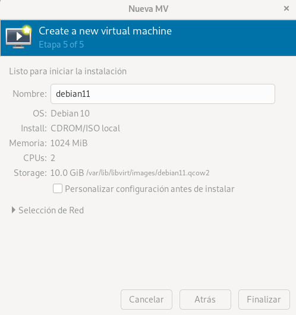
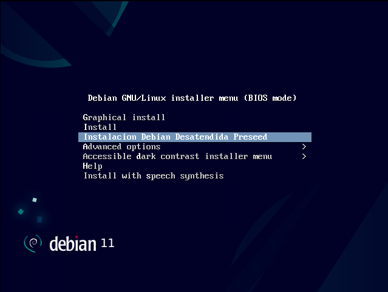
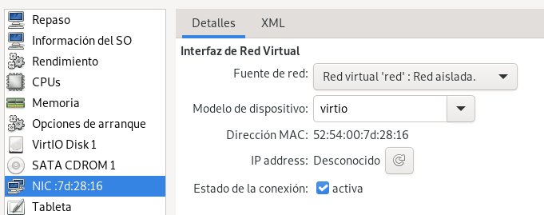
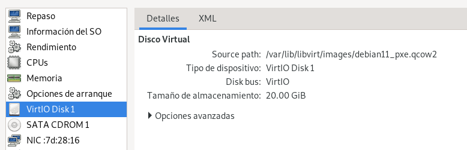
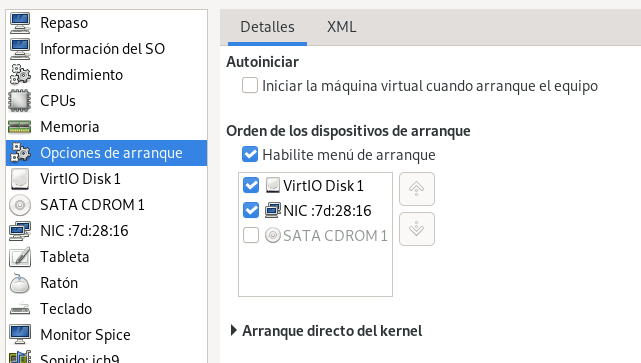
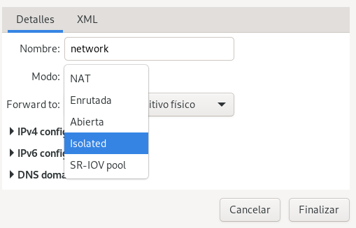
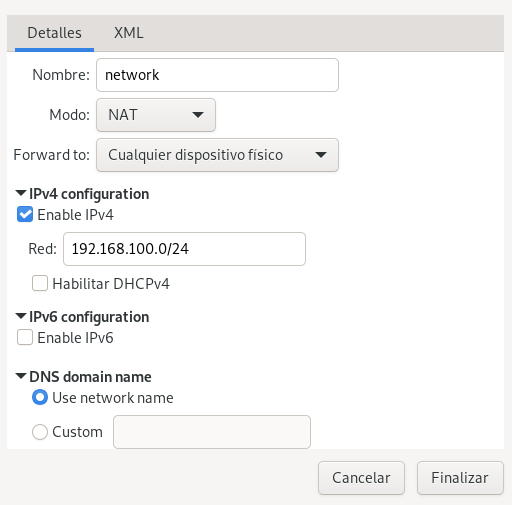

# Instalación basada en fichero de configuración preseed.

1. Descargamos la imagen iso de debian en este caso:

```
curl -#LO https://cdimage.debian.org/debian-cd/current/amd64/iso-cd/debian-11.5.0-amd64-netinst.iso
```

2. Instalamos una aplicación que nos permita manipular la imagen ISO y extraiga los fecheros que tiene contenido en la imagen y crear asi una imagen ISO a partir del sistema de ficheros:

```
sudo apt -y install xorriso
```

3. Se introducen los ficheros contenidos en la imagen net-install en el sistema de ficheros "isofiles" con el siguiente comando, si no existe el directorio lo crea automáticamente:

```
xorriso -osirrox on -indev debian-11.5.0-amd64-netinst.iso -extract / isofiles/
```

4. Descargamos la plantilla preseed de debian:

```
curl -#L https://www.debian.org/releases/stable/example-preseed.txt -o preseed.cfg
```

5. Modificamos la plantilla preseed de acuerdo a nuestra necesidades, en principio se editará de forma sencilla para usar el idioma español y evitar que se realice la encuesta final, además de elegir el entorno de trabajo y la localización del GRUB:

    [preseed.cfg](/preseed_lvm_cryp.cfg)

- GRUB:

```
d-i grub-installer/only_debian boolean true
d-i grub-installer/with_other_os boolean true
d-i grub-installer/bootdev  string default
```

- Selección de paquetes instalados:

```
d-i pkgsel/run_tasksel boolean false
d-i pkgsel/include string openssh-server build-essential
```

- Evitar la encuesta final:

```
popularity-contest popularity-contest/participate boolean false
```

- LVM:

```
d-i partman-auto/method string lvm

##modificación
# If one of the disks that are going to be automatically partitioned
# contains an old LVM configuration, the user will normally receive a
# warning. This can be preseeded away...
d-i partman-lvm/device_remove_lvm boolean true
# The same applies to pre-existing software RAID array:
d-i partman-md/device_remove_md boolean true
# And the same goes for the confirmation to write the lvm partitions.
d-i partman-lvm/confirm boolean true
#d-i partman-lvm/confirm_nooverwrite boolean true
# You can define the amount of space that will be used for the LVM volume
# group. It can either be a size with its unit (eg. 20 GB), a percentage of
# free space or the 'max' keyword.
d-i partman-auto-lvm/guided_size string max
##añadido

d-i partman-auto/choose_recipe select boot-root
d-i partman-auto-lvm/new_vg_name string vg00
d-i partman-auto/expert_recipe string                         \
      boot-root ::                                            \
              1024 1024 1024 ext4                             \
                      $primary{ } $bootable{ }                \
                      method{ format } format{ }              \
                      use_filesystem{ } filesystem{ ext4 }    \
                      mountpoint{ /boot }                     \
              .                                               \
              100 1000 1000000000 ext4                        \
                      $defaultignore{ }                       \
                      $primary{ }                             \
                      method{ lvm }                           \
                      device{ /dev/vda }                      \
                      vg_name{ vg00 }                         \
              .                                               \
              1024 2048 1024 swap                               \
                      $lvmok{ } lv_name{ lv_swap } in_vg{ vg00 } \
                      method{ swap } format{ }                \
              .                                               \
              3072 3072 3072 ext4                               \
                      $lvmok{} lv_name{ lv_var } in_vg{ vg00 } \
                      method{ format } format{ }              \
                      use_filesystem{ } filesystem{ ext4 }    \
                      mountpoint{ /var }                         \
              .                                               \
              3072 3072 3072 ext4                               \
                      $lvmok{} lv_name{ lv_raiz } in_vg{ vg00 } \
                      method{ format } format{ }              \
                      use_filesystem{ } filesystem{ ext4 }    \
                      mountpoint{ / }                         \
              .                                               \
              1072 1072 1072 ext4                               \
                      $lvmok{} lv_name{ lv_home } in_vg{ vg00 } \
                      method{ format } format{ }              \
                      use_filesystem{ } filesystem{ ext4 }    \
                      mountpoint{ /home }                         \
```

6. Modificamos el fichero txt.cfg para que se realice la instalación en español y establezca el teclado en español:

```
label install
    menu label ^Install
    kernel /install.amd/vmlinuz
    append vga=788 initrd=/install.amd/initrd.gz --- quiet 
label unattended-gnome
        menu label ^Instalacion Debian Desatendida Preseed
        kernel /install.amd/gtk/vmlinuz
        append vga=788 initrd=/install.amd/gtk/initrd.gz preseed/file=/cdrom/preseed.cfg locale=es_ES console-setup/ask_detect=false keyboard-configuration/xkb-keymap=es --
```

7. Introducimos el fichero preseed.cfg al directorio isofiles:

```
cp preseed.cfg isofiles
```

8. Creamos la imagen ISO dando permisos de escritura a todos y generamos la imagen con el comando genisoimage:

```
chmod a+w isofiles/isolinux/isolinux.bin
genisoimage -r -J -b isolinux/isolinux.bin -c isolinux/boot.cat -no-emul-boot -boot-load-size 4 -boot-info-table -o preseed-debian-11.iso isofiles
```

9. Creamos la máquina (con 10GB de almacenamiento mínimo) introduciendo como imagen ISO la creada con preseed, al iniciar la máquina aparecerá un menu del que tendremos que seleccionar la opción de instalación desatendida:




# Instalación por PXE

1. Iniciamos una máquina sencilla en vagrant la cual usaremos de servidor DHCP que sirva direcciones ip a los dispositivos que haya en mi red aislada de vagrant.

2. Añadimos una red eth1 a la máquina vagrant con una ip estática, en mi caso se la he añadido desde virt-manager y modificando en el fichero /etc/network/interfaces añadiendo:

```
auto eth1
iface eth1 inet static
      address 192.168.100.10
      netmask 255.255.255.0
```

3. Instalamos el paquete dnsmasq que nos facilita la configuración del protocolo TFTP y DHCP, y editamos el fichero:

```
sudo apt install dnsmasq
nano /etc/dnsmasq.conf
```

Una vez dentro del fichero añadimos lo siguiente:

```
# Configuration file for dnsmasq.
#
#Activación servidor DHCP + establecimiento de rango de direcciones
dhcp-range=192.168.100.50,192.168.100.150,255.255.255.0,12h
#Fichero usado por los clientes para arrancar desde la red
dhcp-boot=pxelinux.0
#Habilitamos el servidor TFTP
enable-tftp
#Especificamos el directorio que contendrá los ficheros
tftp-root=/srv/tftp
```

4. Creamos el directorio especificado para el protocolo TFTP y reiniciamos el servicio dnsmasq:

```
mkdir /srv/tftp
systemctl restart dnsmasq
```

5. Entramos en el directorio /srv/tftp y descargamos los ficheros para la instalación por red:

```
wget http://ftp.debian.org/debian/dists/buster/main/installer-amd64/current/images/netboot/netboot.tar.gz
```

6. Usamos tar para descomprimir el fichero tar.gz:

```
tar -zxf netboot.tar.gz && rm netboot.tar.gz
```

7. Instalamos el servidor apachedonde se almacena el fichero preseed:

```
apt install apache2
```

8. Creamos el fichero preseed en el servidor, para ello creamos y editamos del siguiente modo:

```
nano /var/www/html/preseed.txt
```

[preseed](/preseed_lvm_cryp.cfg)

*Nota: este preseed contiene la contraseña encriptada, se ha conseguido con el comando: ```sudo mkpasswd --method=sha-512 --stdin```

Además, editamos el txt.cfg para que quede del siguiente modo:

```
nano /srv/tftp/debian-installer/amd64/boot-screens/txt.cfg
```

```
label install
    menu label ^Install
    kernel debian-installer/amd64/linux
    append vga=788 initrd=debian-installer/amd64/initrd.gz --- quiet 
label unattended-gnome
        menu label ^Instalacion Debian Desatendida Preseed
        kernel debian-installer/amd64/linux
        append vga=788 initrd=debian-installer/amd64/initrd.gz preseed/url=192.168.100.10/preseed.txt locale=es_ES console-setup/ask_detect=false keyboard-configuration/xkb-keymap=e>
```

9. Activamos el bit de forward para que se pueda realizar SNAT y pasen los paquetes de una interfaz a otra en el servidor:

```
echo 1 > /proc/sys/net/ipv4/ip_forward
```

O editando el fichero /etc/sysctl.conf para que sea persistente asignando el valor 1 a ```net.ipv4.ip_forward```

10. Instalamos nftables para poder hacer NAT, lo arrancamos y habilitamos para que se inicie cada vez que arranque la máquina:

```
apt install nftables
systemctl start nftables.service
systemctl enable nftables.service
```

11. Creamos una tabla nueva en nftables y comprobamos que se ha realizado correctamente, despues creamos el postrouting que permitira que modifique los paquetes antes de que salgan del equipo:

```
nft add table nat
nft list tables
nft add chain nat postrouting { type nat hook postrouting priority 100 \; }
```

12. Añadimos una regla de postrouting que nos permita hacer SNAT dinámico ya que la ip pública puede cambiar y listamos para comprobar que se ha añadido:

```
nft add rule ip nat postrouting oifname "eth0" ip saddr 192.168.100.0/24 counter masquerade
nft list ruleset
```

Para que sea persistente ejecutamos:

```
nft list ruleset > /etc/nftables.conf
```

13. Por último en una máquina vacía configuramos de tal manera que resulte:





Al iniciar la máquina deberemos realizar la accion ```Esc``` para poder entrar al boot e introducir:

```
auto url=[ip]/preseed.txt
```

En mi caso:

```
auto url=192.168.100.10/preseed.txt
```

*Nota: Para poder hacer una red aislada en virt-manager seleccionamos ```Editar > Detalles de la conexión```, una vez dentro añadimos una red en Redes virtuales y la configuramos:



